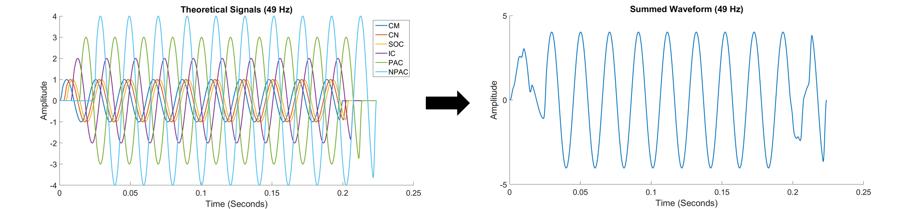
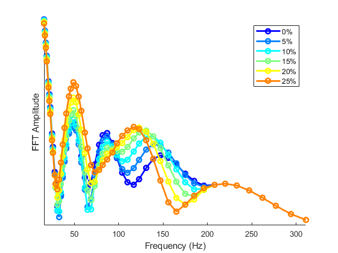
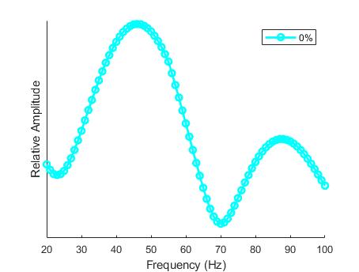

<!-- README.md is generated from README.Rmd. Please edit that file -->

```{r, include = FALSE}
knitr::opts_chunk$set(
  collapse = TRUE,
  comment = "#>",
  fig.path = "Figures/",
  out.width = "100%"
)
```
# Theoretical Frequency-Following Responses

<!-- badges: start -->
<!-- badges: end -->

This is a MATLAB implementation of the Frequency-Following Response (FFR) model based off of Tichko & Skoe (2017) (https://doi.org/10.1016/j.heares.2017.01.014) to simulate the fine structure of FFR spectral amplitudes. The model also includes parameters for simulating the Envelope-Following Response (EFR) reported in Purcell et. al (2004) (https://doi.org/10.1121/1.1798354).

## The Model

The model is a transmission-based model of the scalp-recorded FFR that simulates the waxing-and-waning pattern of human FFRs across a wide range of stimulus frequencies. In this model, multiple sinewaves, each representing the phase-locked output of putative generators (e.g., cochlea, brainstem nuclei), are summed together to create a summation waveform—a waveform representing a scalp-recorded FFR. Each sinewave is synthesized at a given stimulus frequency, offset by a specific latency value to model neural transmission times between generators, and scaled by a specific amplitude value to reflect the relative contribution of a particular generator to the scalp-recorded response. When summed, the sinewaves either interfer constructively or deconstructively in phase, ultimately enhancing or attenuating the global amplitude of the summation waveform, depending on the specific phase relations among the sinewaves that are determined by the latency values and sinewave frequency.

<p align="center">
</p>


## Running the Model
The main MATLAB script to run the model can be found in FFRFineStructureModel.m:

Two sets of parameters, as examples, are included in the main script to simulate Frequency-Following Response or Envelope-Following Response spectral ampitudes. To start, choose one of these sets of parameters:

Frequency-Following Response parameters from Tichko & Skoe (2017):
parameters_TichkoSkoe.m

Evelope-Following Response parameters from Purcell et al. (2004):
parameters_Purcell.m

## Latency Shifts

You can offset the latency of a set of theoretical generators by a specified percentage to see how the fine-structure changes in the frequency domain as a function of generator latency. This parameter specifies which set of theorectical generators to shift in latency. The user can specify generator(s) to change for any combinations of 1 - 6:
  
Shift the latency of generator 5:

gen = [5];


The following two parameters determine the max percentage change of the latency shift and the interval of percentage change, e.g., shift the latency of the generators by 25 percent in intervals of 5 percent:

Total percentage change:  

maxperc = 25;

Interval of percentage change:

percinterv = 5;


## Model Output

Running the script will produce a figure of FFR or EFR specral amplitudes, including amplitudes from latency shifting the generators:

This is a plot of theoretical Frequency-Following Response (FFR) spectral amplitudes as generator 5 is gradually shifted in latency. Notice how the overall morphology of the spectral amplitudes (i.e., the location of peaks and valleys) changes as generator 5 is gradually delayed:
<p align="center">
</p>


This is a plot of the Envelope-Following Response (EFR) originally reported in Purcell et al. (2004):
<p align="center">
</p>

  

