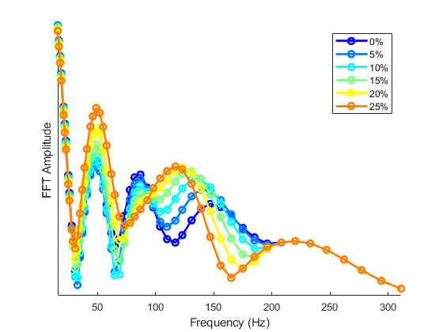
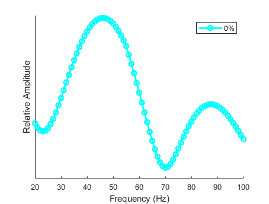

<!-- README.md is generated from README.Rmd. Please edit that file -->

# Theorectical Frequency-Following Responses

<!-- badges: start -->

<!-- badges: end -->

This is a MATLAB implementation of the Frequency-Following Response
(FFR) model based off of Tichko & Skoe (2017)
(<https://doi.org/10.1016/j.heares.2017.01.014>) to simulate the fine
structure of FFR spectral amplitudes. The model also includes parameters
for simulating the Envelope-Following Response (EFR) as reported in
Purcell et. al (2004) (<https://doi.org/10.1121/1.1798354>).

## The Model

The main MATLAB script to run the model can be found in
FFRFineStructureModel.M:

Two sets of parameters, as examples, are included in the main script to
simulate Frequency-Following Response or Envelope-Following Response
spectral ampitudes. To start, choose one of these sets of parameters:

Frequency-Following Response parameters from Tichko & Skoe (2017):
parameters\_TichkoSkoe.M

Evelope-Following Response parameters from Purcell et al. (2004):
parameters\_Purcell.M

## Latency Shifts

You can offset the latency of a set of theorectical generators by a
specified percentage to see how the fine-structure changes in the
frequency domain as a function of generator latency. This parameter
specifies which set of theorectical generators to shift in latency. The
user can specify generator(s) to change for any combinations of 1 - 6:

Shift the latency of generator 5: gen = \[5\]

These two parameters determine the max percentage change of the latency
shift and the interval of percentage change, e.g., shift the latency of
the generators by 25 percent in intervals of 5 percent:

Total percentage change:  
maxperc = 25

Inveral of percentage change: percinterv = 5

## Model Output

Running the script will produce a figure of FFR or EFR specral
amplitudes, including amplitudes from latency shifting the generators:

This is a plot of FFR spectral amplitudes as generator 5 is shifted in
latency:

This is a plot of the ERF from Purcell et
al. (2004):

